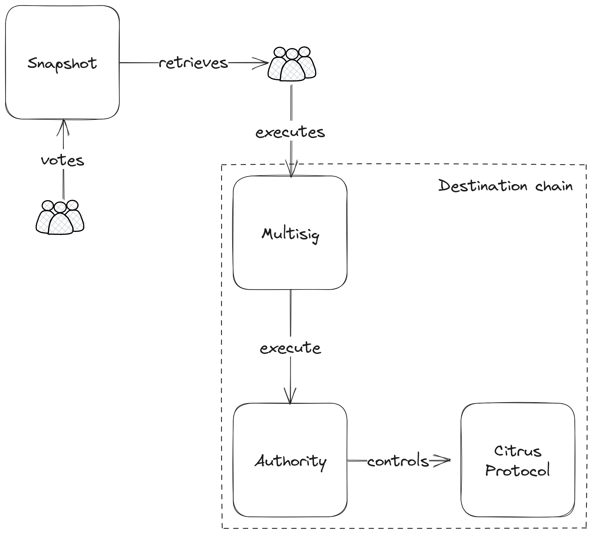
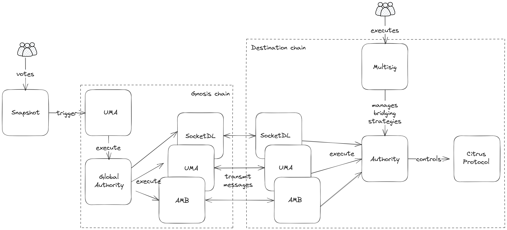

# Governance

Citrus Finance is a decentralized protocol that is governed by CTRS holders. Votes are performated on Snapshot and handled on chain by the Authority contract.

The Authority contract role is to forward vote from Snapshot to the destination chain. Because anybody can deploy Citrus protocol on any chains and AMBs might not be present and configured differently, we cannot let the Authority be setup by anyone. By default the Authority is controlled by a deterministic multisig, which can forward transactions to the Authority or setup AMBs.

## Islanded governance

This is the default state when the protocol is deployed, only a multisig is capabal of performing actions.

## Connected governance

The multisig can setup AMB so that connection betwen chains is possible

