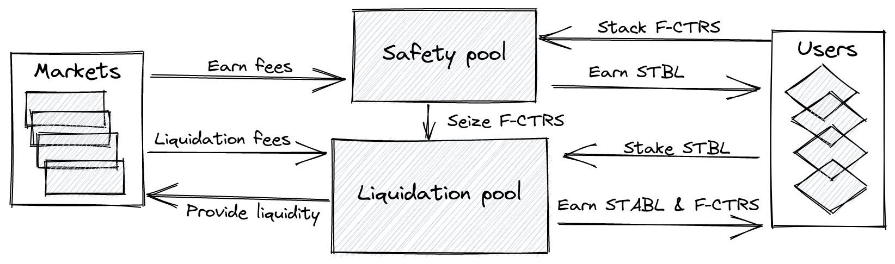

# Staking (coming soon)

You can stake your Franchise tokens against a lending pool. You will collect fees from this pool but your staked tokens can be seized to cover bad debts. To prevent users from withdrawing their staked tokens before a bad debt is cleared, users can only withdraw their staked tokens after initialising 7 days earlier, dividends can be collected at any time.

Upon receiving fees collected from each markets of the pool, the staking contract will try to exchange those tokens to a stablecoin (Dai or other if not available on the chain) for the users to then claim.

For the first iteration, user won't have the choice of dividend tokens, but the plan is for users to select which tokens they want as dividends.

You will be also be able to stake your stablecoins in a liquidation pool, those tokens will be deposited onto the primary market to earn passive income like a as if the user deposited them into a market. Funds deposited into the pool will be used to perform trades during liquidations. In case of bad debt, the funds will be used to cover bad debt and depositors will receive in exchange seized tokens from the security pool.

